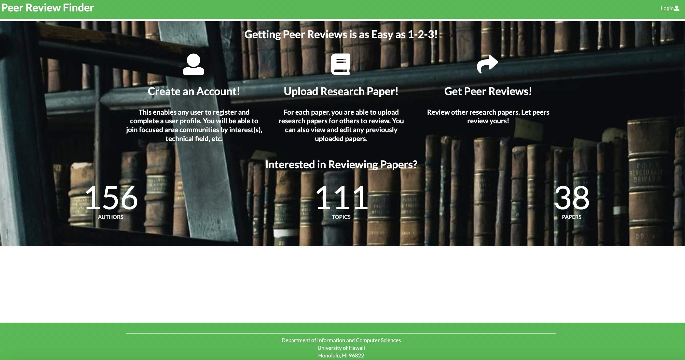
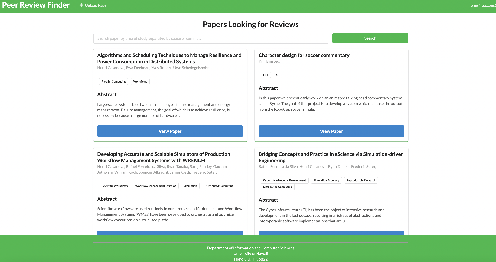

This is putting everything we learned this semester, in a group project, the final step before we go out in the real world of software engineering. 
[Peer Review Finder](https://peer-review-finder.xyz/#/) is a web application which brings researchers together by allowing them to upload their research
papers to get peer reviews before publishing them in journals and conferences and also review other researcher's papers. 

### User Interface 

On retrieving the application, the user should be able to see a brief introduction of the application system, the current total numbers of papers available on the platform along with the count of number of authors and total topics. In the current state of the project, the users can update their profile indicating their research interests, upload their research papers and view the reveiews they got on those papers. The application also displays if there are new papers being uploaded on the platform which matches their interest. The *View Paper* button on the User landing page allows the users to see a list of all the papers uploaded on the application, by other researchers. The uploaded papers are listed with the title, authors' name, keywords of research topics and a view of the abstract of the paper.

On clicking the *View Paper* button (on each paper), one can see the full abstract of that paper, a link to download it and a section to leave (or edit) their reviews on it. We have also tried adding a rating feature that allows the uploader to rate how well the review was provided on that paper. This rating feature is the foundation of the token system, a characteristic which prompts users to remain active on the site, and improves the research process by allowing the users to read and review other papers first, before uploading their paper. This is an important step because journal editors and conference chairs find it increasingly difficult to find reviewers for publication manuscripts, which is simplified by the token system in Peer Review Finder. All users are issued some default tokens on registering, and more can be gained by providing constructive reviews on the papers. The number of tokens credited to the reviewer depends on the ratings provided by the original uploader.

### Publishing Peer Review Finder

Since this is an academia based application, we started looking for different journals, conferences and other publication mediums and found that [Educational Technology & Society](https://www.j-ets.net/author_guide) journal will be a suitable publication venue. ETS journal aims to bring together developers, educators and researchers to foster the development of research in educational technology and thus diversifying the groups into authors, reviewers and readers. This objective of the journal matches with that of our application which makes it a good platform to help fellow peers find peer reviewers for their paper and do the same for other peers. For now we targeted graduate students as our main audience to give them a good starting point, allowing them to get familiar with the research process and collaborate and connect with other professionals.

### Future scope

Since this was a class project, we had limited time to work on the application and hence it is not yet ready to be deemed as a publishable research. Based on the community feedback we got from a diverse group of people (undergraduate, graduate students and professors), a lot of functionality is still missing. We can improve on basic features like introducing autocompletion of keywords, relocating some components on the webpage, a confidentiality aspect to name a few. We could also improve the token system to introduce more factors like depending on which platform the user is tryingg to publish their work we can award tokens accordingly. If the users attend some conference, or have good academic records more tokens can be credited to them. We could also add in a feature to link the user account to ORCID/Google Scholar/LinkedIn to help display their work while also allowing building a connection and collaboration simultaneously.

To improve the overall functionality of our application and add more enticing features, we need to approach and get feedback from a larger group of people (perhaps more students and professors from different academic fields and locations). We could also try and look other similar applications to get some idea about the features which could make our application better. I also feel that maybe some experienced software developers could suggest as to how to add in those functionalities without complicating the code. 

A complete information about Peer Review Finder, our project board to reach the current state of the project and PRF's github.io page can be found [here](https://peer-review-finder.github.io/).
