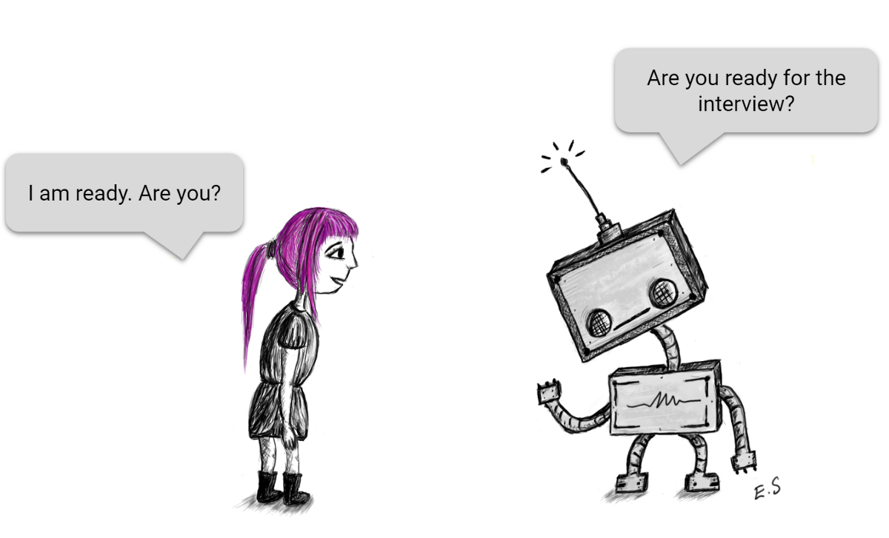

You must be wondering if I am talking about Robert Frost's poem or some career path which very few people choose. It's neither because this essay is about my
experience and expectations with software engineering. At one point in time I considered being a software engineer and then I dropped that idea only to realize there might be a better way to do it.

## DIKW pyramid

The world is so big and there is so much to explore but still most of the people aim for a good job in some big, tech company. Sure enough I did too, and with
time I realize the reason this happens is because computer science is the glue that holds everything together. From natural science to medicine to marketing to 
pretty much everything, you name a sector and it is incomplete without computer science. And what lies at the core of this interdisciplinary field: "programming". 
During my undergraduate studies in physics my doubts were even more cleared when I learned from my professors that you don't just solve some scary equations while 
sitting in a far corner of the room. But you use this theoretical knowledge with the technical advancements and discover something new! Last semester, in my
"Medical Informatics" course I was reminded about the same teaching. Computer Science is not just about sitting in a boring cubicle and staring at your screen
all day, finding bugs in your code, but it is about finding your interest in a domain and climb up the DIKW pyramid. Data, Information, Knowledge and Wisdom (or 
DIKW) pyramid is about using the abundance of available data and information from your research interests to understand the challenges and provide an insight and
reliable solution to it. And that's what define our department too, Information and Computer Sciences.

## I hate swimming but I am diving deep into Software Engineering

One thing I have understood is that you either love programming or you don't, there's no in-between. So, once I was introduced to C++ in my high school I decided 
this is what I'm going to do now. How? I didn't know but I intend to learn that from this course. I have had a good start with JavaScript and hope it goes well. To
continue with that, one skill I am considering to develop from this class is to write a presentable and efficient code. Once you learn about the data structures,
iterators and other basic concepts of any programming language, it is easy to forget how you can use those to make your code better. Instead os using variables
what if I use array or better what if I destructure the object. This takes a lot of practice and experience and I wish I will master this one day (atleast I can hope 
for that). Another skill I want to hone is GitHub and collborating with other developers. I have never used GitHub to store any of my past projects/research works and 
I wish someone would have taught me that before. 

## It is okay to be confused

I sometimes find myself struggling between academic research and tech industry and I am hoping I will sort it out byt he end of this semester. My interest varies
from artificial intelligence to natural science to web development, which I want to give a try. So, I look forward to the upcoming modules and working with other 
fellow students to see and learn how one should approach a problem, how one should work in a team. Maybe I will get my dream job one day!

