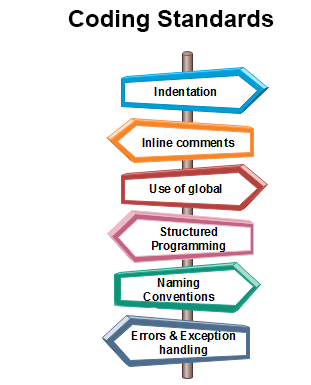

Maintaining standards, whether in life or in programming, is the key to success. When writing a program, in any language, it is important to keep in mind the basic
coding standards. The solution to a problem can be obtained by both the clean and the messy code with its successful compilation. For now I'm just working on small projects but if we were to maintain a  large codebase like Google (discussed [here](https://jaiswal-aditi.github.io/essays/The-multiverse-of-SE.html)), or run multiple applications which requires updates once every few years, which one do you think would be easy to work with? I hope you say the clean one! A clean code complying to coding standards make development, readability, maintenance and debugging much easier. I am used to Python now and those familiar with the syntax know that if one were to use a code block of conditional statement or loops or function, you either have to leave 4 blank spaces to indent the code or Python will automatically do that for you. I used to get annoyed by this because initially I'll always get an error because of indentation issue. And I remember once a friend of mine saw my code and started laughing about why I leave spaces in the code blocks and I replied in a high-fashion manner saying: "this is is code ethics", (when I clearly meant coding standard format). Clearly, I was confused between the terms coding ethics and coding standards and I didn't pay any attention then. But since then I have come to understanding that this annoying thing is actually very helpful because the next time if I or someone else is trying to read and debug my code, it is so much easier to read (and feels good by not seeing any clutter). So, when I started coding in Javascript for this class I was so habitual with the indentation that I will automatically hit the tab button as soon as I was inside a code block! That sure looks good.

### IntelliJ IDEA (indeed a brainy idea by JetBrains)

As we are progressing through the semsester we are also trying to merge different applications. So we are not limited to just solving some WODs (discussed [here](https://jaiswal-aditi.github.io/essays/Is-Javascript-my-karma.html)), but also learn to use right tools (editors, IDE) and platform (GitHub) to store our work, which I'll be using some day in future after I get a good job (^wink ^wink). And so we have started with IntelliJ IDEA, an integrated development environment, used for software development. I have never used this before so I am excited to learn more about this and for now it seems really nicely organized environment. There was a fun activity hosted by our professor so as to declare the key binding shortcut champion and I didn't do well in that but I can see how those can make our lives much easier. Using key binding shortcuts for any editor or IDE or platform is good to learn because you can do things fastly. (Fun fact: I used to feel so smart after learning the Linux commands lines but it also made working with the system simpler.) 

### Making IntelliJ more intelligent with ESLint

ESLint is a pluggable code analysis tool to easily maintain your code and stick to the coding standards while getting fewer errors. It is easy to let your IDE know that it has to use ESLint to report for any errors by setting right preferences. And although it sounds a great tool, it is kind of annoying. It will report every small details which makes you a not-so-good programmer, whether it be bad variable names, using let instead of const, missing indentation or blank spaces etc. These things may not negatively affect the functionality of your code or may not have affected the readability but behind the scenes ESLint is just trying to maintain its own standards (along with coding standards) and make your and your computer's life easier. So it doesn't have to worry about any variable which you are not going to use later or it doesn't have to hold a variable with a silly name. But the good thing is it will help you along the process it will guide you where the error is by raising red flags and what the error is. You just have to correct those mistakes and ESLint will approve you by giving a green checkmark!

Overall I'd say I'm starting to see the good side of IntelliJ for developing a Javascript project and how ESLint can make your code look much presentable and readable. It forces you to follow proper etiquettes to become a better developer or programmer and make the collaborative projects look good. In the initial stage, we all use some random variable names like foo to store the results temporarily and see what the code is doing and that is okay. But once you become more confident about your work and start working with other collaborators, it is always a better idea to use releveant variable names so that when you or others take a look at your code (or are trying to debug it), you'd know what that variable was supposed to do. It also allows you to maintain a consistent style across your code. So sit back, relax, and work on your code because ESLint is here to help you with your coding journey.

