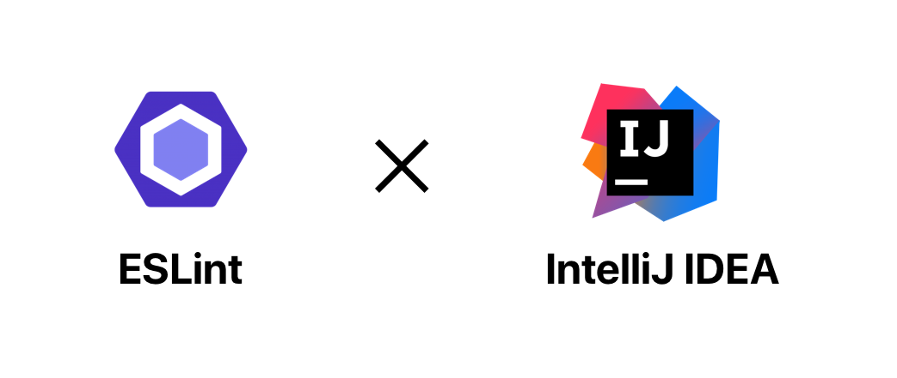
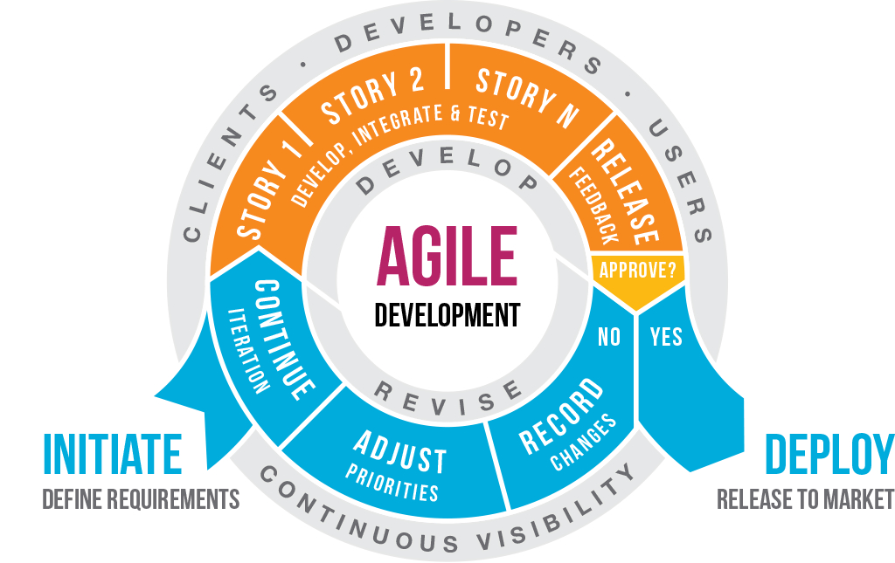

Phew!!! The semester is over and that concludes my journey as a software developer (for now). Am I going to rise from ashes? Only time will tell, but for now I'm going to write about my learning from this class. 
  
This course was like riding a roller-coaster, something which I have literally never experienced in my life. I still remember contacting multiple graduate students before enrolling in this class as I was really scared that I'd make a complete fool of myself. But I'm glad I took the risk because what a rewarding journey this was! ICS613 as a subject introduced me to the corporate world of web development, software engineering and team work (yes, software engineering is also about those soft skills). Over the course of the semester I learned many concepts, starting with basic Javascript, functional programming, coding standards, then switching gears into user interface (Semantic UI, React), database (MongoDB), software ethics and finally coming a full circle with agile project management. 

  
### Software Engineering is not just sitting in front of your computer and coding (blindly)
  
Other than the technical knowledge, this is my biggest takeaway from this course as it completely changed the notion in my head. It's not about doing a 9 to 5 job, sitting in front of your computer and typing thousands of lines code. But instead software engineering is more about designing, documenting, testing, debugging in creating and maintaing applications built for other users and this is where communication, team work and creativity becomes important. Here I digressed again (sorry but I have to remind thse points to myself and others who need to hear this, again and again, about how software development is a complete process. It is not something which only men do, an idea my parents still believe in but anyways.....)

### Coding Standards

This is the very first topic whose importance stirred me up. The placemenet of brackets, indentation, spacing etc are small things which can make your code look much more cleaner and professional. It makes development, readability, maintenance and debugging of the code much easier. And luckily we have many different tools and editors to help us develop good coding practice. 

### Agile Project Management

It is an iterative approach to deliver a project but through the increamental steps of getting feedback from the users and making those changes accordingly, communication over different tools and processes. In this course we practiced this throughout our group project using Githb tools. We first brainstormed and came up with with features we want to include in our project for which we then Github issues to create  project board, dividing our issues in three categories: to-do, in-progress and done. After this we divided the issues amongst our team members to let each of us focus on a specific part, allowing for better collaboration and learning. This led to an even distribution of work while also allowing other members to see the status of each issue and use a part of it once it was finished by other members. All the features we came up with was further divided into three milestones to build the application step-by-step. This *issue driven project management* was one of the best team project I ever did. 
