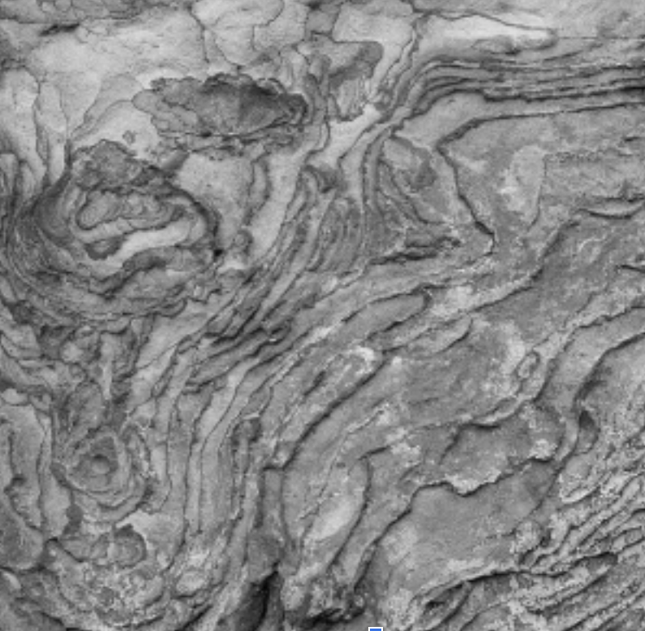

Image texture is an important feature in computer vision tasks. Textural features have been developed to allow for objective comparison of textures between images and image regions. [Haralick] (https://ieeexplore.ieee.org/document/4309314) introduced the Gray-Level Co-Occurrence Matrix (GLCM) in 1973 as a necessary step for the computation of the Haralick texture features. The GLCM is a flexible measure of spatial dependence between pixel gray levels which is defined by an angle, a distance, and the unique gray tones in an image.

MPI is a standard message passing interface designed for distributed memory systems, providing routines for both blocking, non-blocking and collective communication between processes. We implemented two different parallel implementations of the GLCM construction process in C using MPI: row-based and tiled. The row-based parallel algorithm computes the GLCM for a particular combination of a grayscale image `A`, an angle `a`, a distance `d` and number of processes `X`. The tiled parallel algorithm computes the GLCM for a particular combination of a grayscale image `A`, an angle `a`, a distance `d` and a number of processes `X`.

Source: <a href="https://github.com/sorapk/parallel-haralick"><i class="large github icon"></i>theVacay/vacay</a>
