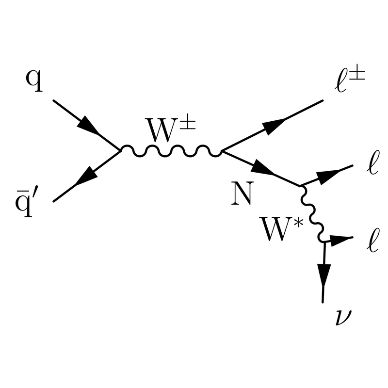

Despite being one of the most successful theories of the past century the `Standard Model (SM)` also has its flaws, unable to explain the baryon asymmetry, neutrino masses, dark matter and dark energy. In this work, a preliminary study was performed to see whether it is possible to detect a heavy neutral lepton (HNL), with the ATLAS detector, using a final state that features dileptons and hadrons. 

HNLs can be produced by the decay of a W boson to a lepton and a neutrino, where the neutrino oscillates into the heavy neutral lepton. Experimentally, it is well established that the relativistic flavour neutrinos &nu;L (or anti-neutrinos) are always produced in left-handed LH (or right-handed RH) dominant weak interaction processes, which are described by a chiral LH field in SM. Since neutrinos have no charge, there is a postulate of RH anti-neutrino being neutrino’s CPT and Lorentz partner, which gives them four degrees of freedom: the left and right-handed neutrinos and the left and right-handed anti-neutrinos. But these RH neutrinos &nu;R interact very weakly with the matter and are “sterile” or “inert” in nature. When they decay into another lepton and a quark-antiquark pair (which then hadronises), a final state featuring two charged leptons and a hadron is arrived at. A search targeting this final state was performed for this work which has a signature of displaced vertex, and thus, the event selection was optimised in a way to maximize the efficiency for the semi-leptonic decay mode and minimize the background levels.

The base of my analysis was formed by the Monte Carlo truth samples, generated using Pythia, where it predicts that W bosons decay into HNL and leptons. Using an event loop algorithm, a loop over all the particles from this truth particle container was run to recover them. In hadronic decay mode HNL decays into a lepton and a quark- antiquark pair. These quark-antiquark pair then hadronises and can be found at the end of the HNL decay chains, so we look at each particle from the container and check if it is HNL or daughter of HNL or daughter of daughter of HNL and so on…  Each particle can be verified using the Monte Carlo particle numbering scheme, provided by **"Particle Data Group (PDG)"**, which assigns a unique code to each type of particles. 

We observed a lot of kaons and pions as these constitute the majority (almost 99%) of the hadrons obtained from the HNL decay. Then, we verified our hadronic invariant mass distribution obtained HNL- active neutrino mixing by comparing it against a set of experimental data, where average hadron multiplicities per e- e+ annihilation events were given for different center of mass energy. This was then extended to study the charged hadron (or their decay product's) multiplicities because that is what we observe in a detector. This was important because it gives us an idea of number of particles or tracks we can expect to observe from HNL decay, when doing real life experimental study.

Because I had limited time to work on this project and given this is still an ongoing research at CERN, Geneva in collaboration with other researchers, I can't provide any source code but I am happy to discuss more about this work. 
